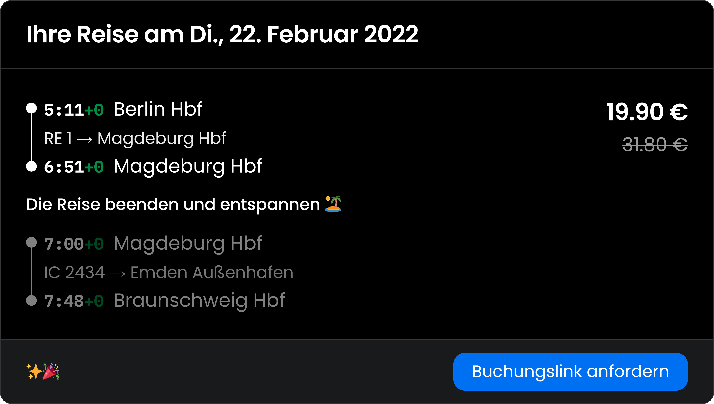

# Baahn! 🚂

`baahn` lets you find special connections saving money
when travelling with [Deutsche Bahn (DB)](https://bahn.de).
It's using [`hafas-client`] (huge thanks!) under the hood for
fetching information about the journeys.

Suppose you want to travel from `Berlin Hbf` to `Magdeburg Hbf`.
This package finds a longer journey that contains the actual journey
but is actually cheaper (yep, the DB price system is weeeird).

The output of the `baahn` web app:



## Installation
Currently, you need an access token to install this package 😔.
If you have one, add the GitHub Package registry (where this package
is published) to your `.npmrc`.
```
@roehrt:registry=https://npm.pkg.github.com
//npm.pkg.github.com/:_authToken=<your token>
```

Install the package with:
```shell
npm i @roehrt/baahn
```

## Example

```javascript
const { findJourneys } = require('@roehrt/baahn');
findJourneys('8011160', '8010224').then((data) => {
  console.log(require('util').inspect(data, {depth: null, colors: true}))
});
```

More information on how to use `findJourneys` can be found in [`index.ts`](index.ts).
For finding the station ids [`hafas-client`] is recommended.
For everyday use consider using the [`baahn-cli`] package.

## Known Bugs
There are some complications with the recognition of cheaper journeys
caused by nearby/identical stations with different name, e.g. `Berlin Hbf`
and `Berlin Hbf (tief)` and non-long-distance train stations. For further information visit the rather
spartan [FAQ](https://baahn.vercel.app/faq) (German).

## See Also

[`baahn-cli`] - a simple cli wrapper for this module.

[`hafas-client`]: https://github.com/public-transport/hafas-client
[`baahn-cli`]: https://github.com/roehrt/baahn-cli
